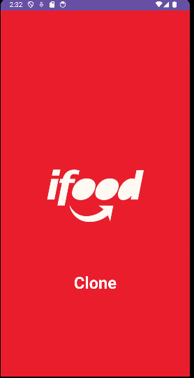
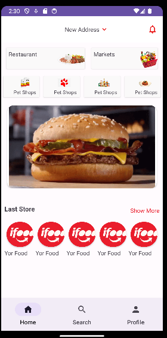

<h1 align="center">
  

   
   
  Ifood clone
</h1>

<h4 align="center">
  Aplicativo desenvolvido com a finalidade de estudo e aprendizagem...
</h4>

## Sobre
Em desenvolvimeto...

## Projeto
Desenvolvido com as tecnologias mais recentes no desenvolvimento de aplicações Android.

## Tecnologias

-  [Kotlin](https://kotlinlang.org/)
-  [Glide](https://github.com/bumptech/glide/)

